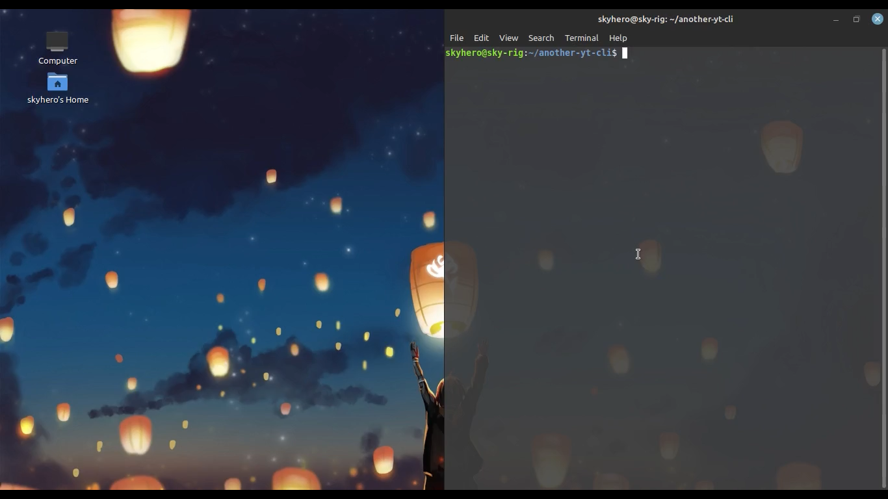

# Yet Another yt-cli

- **What can it do as of now ?**
> It can It can query the input entered by user on youtube and get the first matching result, and play it in the video player.

- **Things to improve:**
> - Let the user choose the video by giving them the first 10 or so search results.
> - Allow users to set the resolution as per their preference.

---
## Demo:

